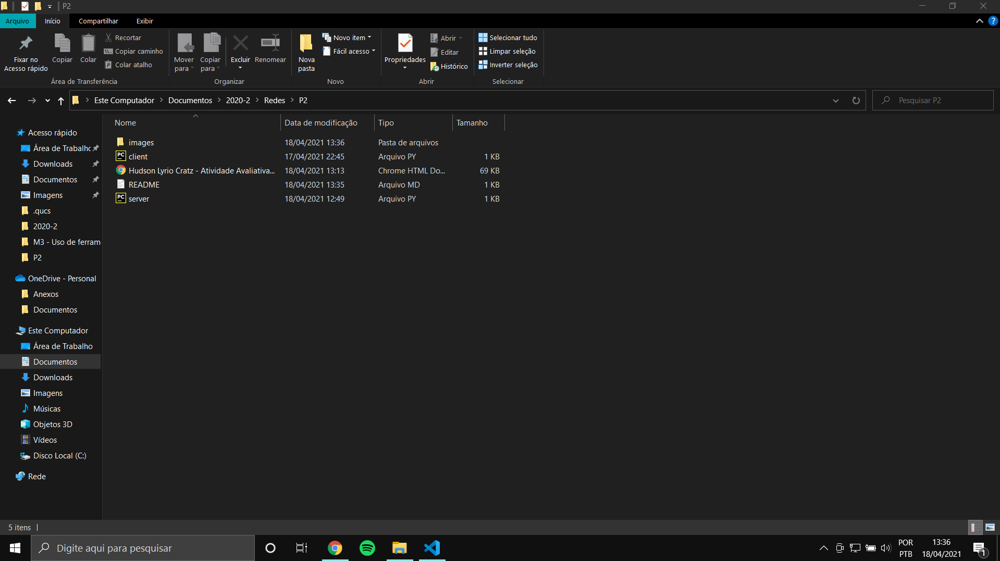
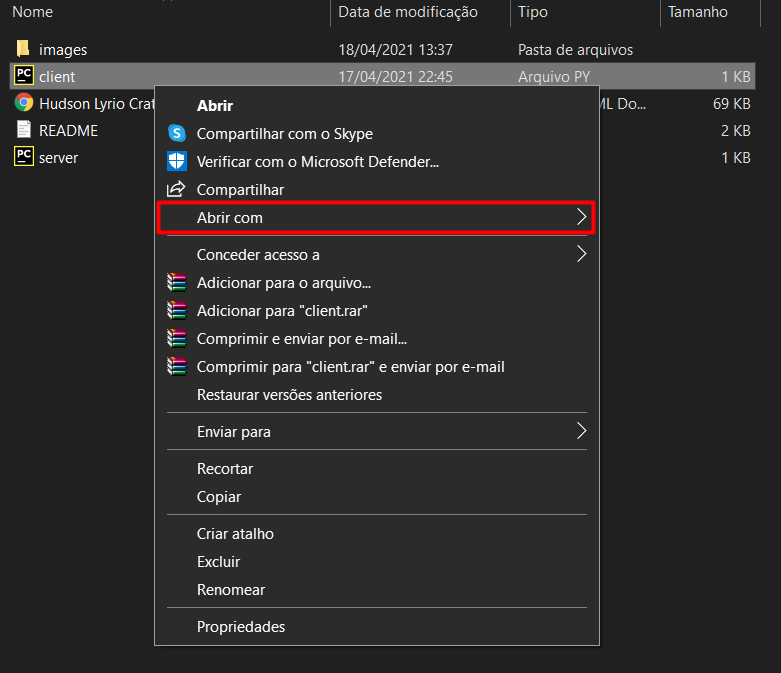
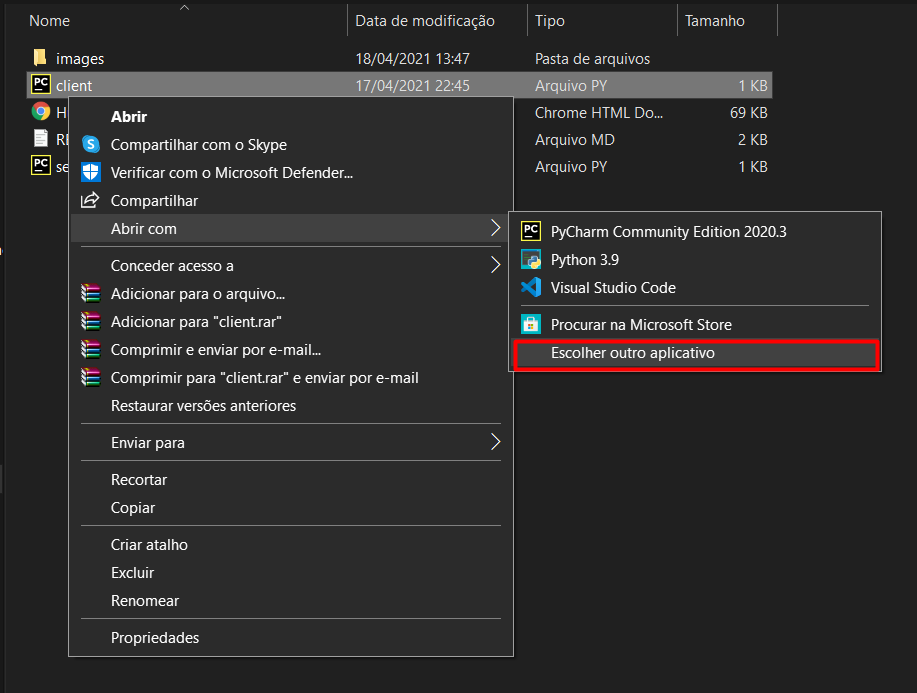
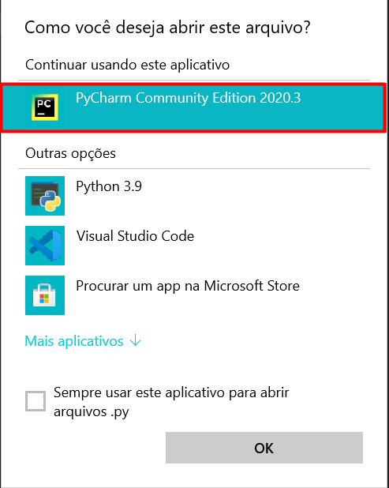
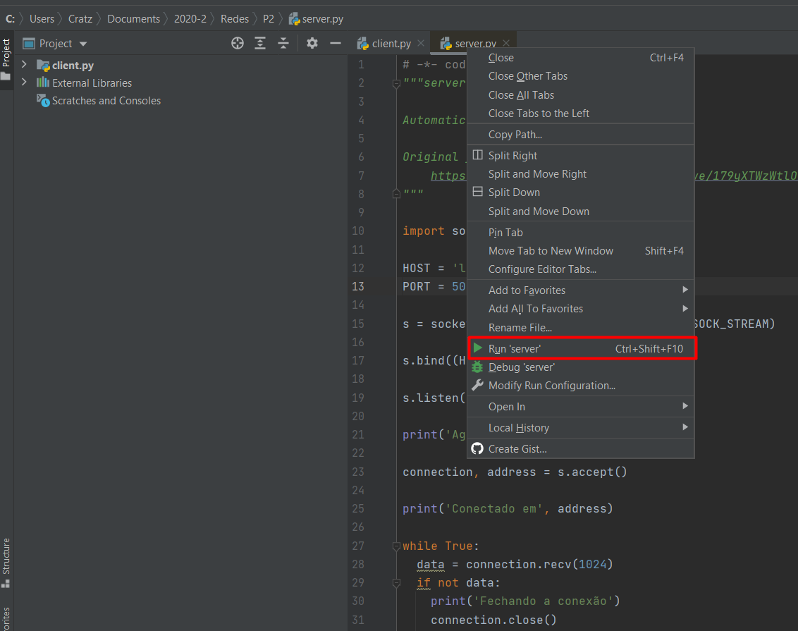
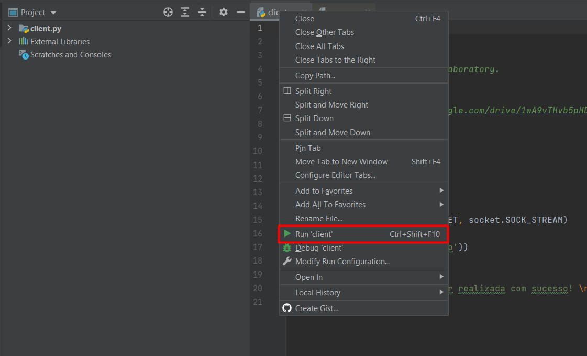

<h1> Socket TCP</h1>

🇺🇸 - English

## 🚀 Technology

This project was developed with the following technologies:

- [Python](https://www.python.org/)

## 💻 Project

This project creates a python application using the socket TCP implementation, that allow to send massages between two processes of this application.

## 📖 Use Guide

```
import socket
```

To run the application, use the IDE you prefer, in my case I used pycharm, and I will explain the execution from there.

- Go to the folder where the files [server.py] (server.py) and [client.py] (client.py) are, and open them with the pycharm IDE.



- If the file with the extension .py, is not directly linked to IDE, just click on the file with the right button and click on "open with".



- If the pycharm application appears, you can select it, otherwise click on "choose another application"


<br><br>


On the pycharm, right click on the file [server.py](server.py), and go to the option "Run 'server'"



Afterwards, right click (on the pycharm) on file [client.py](client.py), and go to the option "Run 'client'"


<br><br>
🇧🇷 - Português

## 🚀 Tecnologias

Este projeto foi desenvolvido com as seguintes tecnologias:

- [Python](https://www.python.org/)

## 💻 Projeto

Este projeto cria uma aplicação em python usando a implementação de socket TCP, que permite a troca de massagens entre dois processos desta aplicação.

## 📖 Guia de uso

```py
import socket
```

Para rodar a aplicação, utilize a IDE que preferir, no meu caso utilizei o pycharm, e explicarei a execução a partir dele.


- Vá a pasta em que estão os arquivos [server.py](server.py) e [client.py](client.py) e os abra com a IDE pycharm.


- Caso o arquivo com a extensão .py, não esteja diretamente lincada a IDE, basta clicar em cima do arquivo com o botão direito e clicar em "abrir com".


- Caso apareça o aplicativo do pycharm pode seleciona-lo, caso contrário clique em "escolher outro aplicativo"


<br><br>


No pycharm, clique com o botão direito em cima do arquivo [server.py](server.py), e vá até a opção " Run 'server' "


Posteriormente, clique com o botão direito (no pycharm) em cima do arquivo [client.py](client.py), e vá até a opção " Run 'client' "

